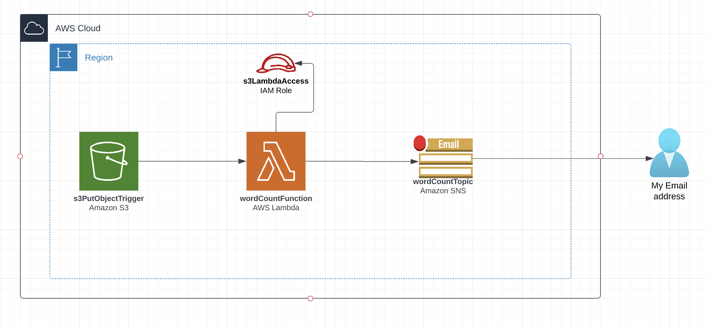

# s3-lambda-sns

* Create an AWS Lambda function to count the number of words in a text file. The general
  requirements are as follows:
  * Use the **Terraform** to develop a **Lambda function** in Python and to create
    its required resources.
  * Report the word count in an *email* using an **Amazon Simple Notification Service (SNS)**
    topic. Optionally, also send the result in an *SMS (text)* message.
  * Format the response message as follows:,
        `The word count in the file <textFileName> is nnn.`
    Replace *textFileName* with the name of the file.
  * Specify the email subject line as: *Word Count Result*
  * Automatically trigger the function when the text file is uploaded to an **Amazon S3 bucket**.
* Test the function by uploading several text files with different word counts to the S3 bucket.
* Forward the email produced by one of your tests to your instructor along with a screenshot of your
   Lambda function.
* You will need an AWS Identity and Access Management (IAM) role for the Lambda function to
  access other AWS services. Since the lab policy does not permit IAM role creation, a role called
  LambdaAccessRole should be used.
  LambdaAccessRole role provides the following permissions:
  * AWSLambdaBasicExecutionRole
  * AmazonSNSFullAccess
  * AmazonS3FullAccess
  * CloudWatchFullAccess

# Infra Diagram

